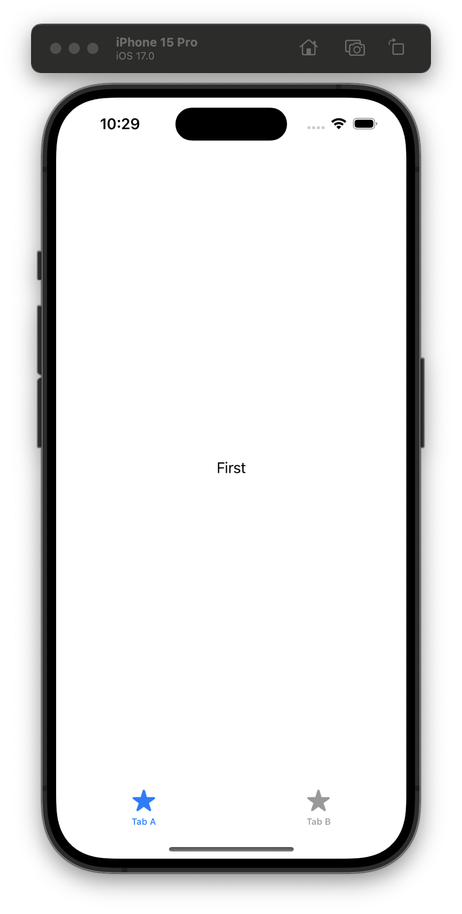

#  FB13375399 - SwiftUI: TabView tabItem should support foregroundStyle as ShapeStyle, not just Color

## Scenario

An app has a TabView. The tabItems show an Image and Text that should be styled like normal Image and Text.

## The Issue

Setting the foregroundStyle to a gradient or color is not applied. Only tint works, but tint does not support ShapeStyle.

## Example Code

The example contains a TabView with 2 tab items. 

## Tested on 

- iOS 17.0
